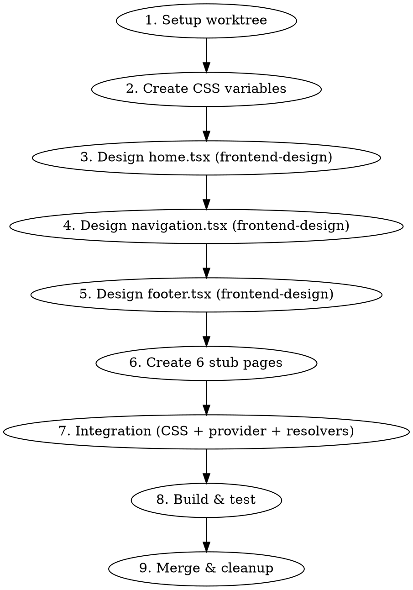

# Create Theme

Orchestrates the creation of a new theme for the turing-software site (agence de developpement web/mobile). Each theme must be an **original creation from scratch**.

Tu dois inventer : un design original, une structure originale, une atmosphere originale, une identite visuelle originale. Le seul point commun entre les themes est le systeme d'integration.

**REGLE ABSOLUE — ZERO CONNAISSANCE DES AUTRES THEMES:**
- **Ne lis JAMAIS** les fichiers dans `components/themes/` (ni le code, ni les noms de dossiers)
- **Ne lis JAMAIS** le tableau `THEMES` dans `components/theme-provider.tsx` pour voir les themes existants
- **Ne parcours JAMAIS** `styles/themes/` pour voir les palettes existantes
- **Ne fais AUCUNE recherche** (Glob, Grep, Read, ls) sur les themes existants
- Tu n'as besoin d'aucune connaissance des autres themes pour creer le tien
- Les seuls fichiers existants que tu dois lire sont les **resolvers** (`components/navigation.tsx`, `components/home-content.tsx`, etc.) pour y ajouter ton import — rien d'autre

**REQUIRED SUB-SKILL:** Use `frontend-design:frontend-design` for all creative design work (home.tsx, navigation.tsx, footer.tsx). This ensures high design quality and avoids generic AI aesthetics.

## Input

**Syntaxe:** `/create-theme [count] [concept]`

- `count` (optionnel) — nombre de themes a creer. Default: **1**.
- `concept` (optionnel) — nom, atmosphere, direction visuelle du theme.

**Exemples:**
- `/create-theme cyberpunk` → 1 theme cyberpunk
- `/create-theme 3` → 3 themes, concepts inventes automatiquement
- `/create-theme 2 retro` → 2 themes retro (variantes distinctes)
- `/create-theme` → 1 theme, concept invente automatiquement

### Mode autonome (sans concept)

Quand aucun concept n'est fourni, **invente toi-meme** un concept original :
- Choisis une direction creative forte et inattendue
- **Ne lance PAS le skill brainstorming** — invente et pars directement
- Ne demande pas confirmation a l'utilisateur
- Ne lis aucun theme existant (voir regle absolue ci-dessus)
- Si `count > 1`, chaque theme doit avoir un concept **radicalement different** des autres

### Mode multiple (`count > 1`)

Quand plusieurs themes sont demandes :
1. Determine d'abord tous les concepts (inventes ou derives du concept fourni)
2. Execute le workflow complet pour chaque theme **sequentiellement** (un worktree a la fois)
3. Chaque theme doit etre merge sur `main` avant de passer au suivant
4. Chaque theme utilise le skill `frontend-design:frontend-design` independamment

## Workflow



### Phase 1: Setup

1. Derive `<id>` (kebab-case) and `<Id>` (PascalCase) from the theme concept
2. Create worktree:
```bash
git worktree add .worktrees/theme-<id> -b feature/theme-<id>
cd .worktrees/theme-<id>
npm install
```

### Phase 2: CSS Variables — `styles/themes/<id>.css`

Create the theme's color palette with selector `[data-theme="<id>"]`.

**IMPORTANT:** L'`id` doit correspondre exactement :
- au selecteur CSS `[data-theme="<id>"]`
- au nom du dossier `components/themes/<id>/`

**All these variables are mandatory:**
```
--brand-primary, --brand-accent, --brand-text, --background, --foreground,
--card, --card-foreground, --popover, --popover-foreground, --primary,
--primary-foreground, --secondary, --secondary-foreground, --muted,
--muted-foreground, --accent, --accent-foreground, --destructive,
--border, --input, --ring, --chart-1, --chart-2, --chart-3, --chart-4,
--chart-5, --sidebar, --sidebar-foreground, --sidebar-primary,
--sidebar-primary-foreground, --sidebar-accent, --sidebar-accent-foreground,
--sidebar-border, --sidebar-ring
```

Choose **original colors** that form a coherent palette matching the theme's atmosphere. N'utilise pas les memes couleurs que les themes existants.

### Phase 3: Creative Components (invoke frontend-design)

**CRITICAL:** Before coding each of these 3 components, invoke the `frontend-design:frontend-design` skill. This is what makes the themes distinctive and avoids generic AI output.

**Creative effort distribution:**
- `home.tsx` — **80%** of creative effort. The masterpiece. Ambitious, original, visually striking.
- `navigation.tsx` — **15%**. Fully designed: desktop, mobile, hover states, optional CTA.
- `footer.tsx` — **5%**. Coherent with theme, properly closes the homepage experience.

Each component:
- Is `"use client"`
- Has a named export: `<Id>Home`, `<Id>Navigation`, `<Id>Footer`
- Lives in `components/themes/<id>/`

#### `home.tsx` — Piece maitresse

Le design doit etre complet, ambitieux, original, fort visuellement, coherent avec la palette, adapte a une agence premium de developpement web/mobile.

Sections possibles selon la direction choisie :
- hero
- preuves sociales
- services
- portfolio preview
- chiffres cles
- temoignages
- process
- CTA
- sections editoriales
- visuels
- animations
- compositions asymetriques ou minimalistes

#### `navigation.tsx`

Doit etre completement pensee :
- desktop et mobile
- etats hover
- structure claire
- CTA eventuel
- style coherent avec la homepage

#### `footer.tsx`

Doit etre coherent avec le theme. Contenu minimum :
- les liens de navigation
- un copyright

#### Contenu textuel

Le contenu doit etre adapte a une agence de developpement web/mobile, mais peut varier dans :
- le ton
- le style
- l'approche
- le niveau de sophistication
- le positionnement

**Navigation must link to:** `/`, `/creation-site-web`, `/application-mobile`, `/site-e-commerce`, `/portfolio`, `/a-propos`, `/contact`

### Phase 4: Stub Pages

Create 6 minimal stub components in `components/themes/<id>/`:

| File | Export |
|------|--------|
| `creation-site-web.tsx` | `<Id>CreationSiteWeb` |
| `application-mobile.tsx` | `<Id>ApplicationMobile` |
| `site-e-commerce.tsx` | `<Id>SiteEcommerce` |
| `portfolio.tsx` | `<Id>Portfolio` |
| `a-propos.tsx` | `<Id>APropos` |
| `contact.tsx` | `<Id>Contact` |

Each stub contains only:
- un conteneur simple coherent avec le theme
- un titre de page
- un court texte placeholder coherent avec le ton du theme
- un lien retour vers l'accueil

**Do NOT** spend design effort here. Les pages secondaires ne doivent **pas** recevoir :
- de gros efforts de direction artistique
- de layout complexe
- de storytelling detaille
- de systeme de sections complet
- de travail creatif comparable a la homepage

### Phase 5: Integration

Three integration points:

**A. CSS import** — Add to `app/globals.css`:
```css
@import "../styles/themes/<id>.css";
```

**B. Theme registration** — Add to `THEMES` array in `components/theme-provider.tsx`:
```tsx
{ id: "<id>", name: "Nom Affiche", emoji: "X" },
```

**C. Resolver wiring** — Update all 9 resolver files in `components/`:
- `navigation.tsx`, `footer.tsx`, `home-content.tsx`
- `creation-site-web-content.tsx`, `application-mobile-content.tsx`, `site-e-commerce-content.tsx`
- `portfolio-content.tsx`, `a-propos-content.tsx`, `contact-content.tsx`

Each resolver needs: import + entry in `themeComponents` map.

### Phase 6: Build & Test

Developper et tester :
```bash
npm run dev
```

Verifier le build :
```bash
npx next build
```

Must pass without errors. If it fails, fix and retry.

### Phase 7: Merge & Cleanup

```bash
cd /home/sriviere/turing/turing-software
git merge feature/theme-<id>
git worktree remove .worktrees/theme-<id>
git branch -d feature/theme-<id>
```

**Ask user confirmation before merge.**

## Outils disponibles

### Classes utilitaires (definies dans `globals.css`)

Classes qui s'adaptent automatiquement aux variables du theme :
- `bg-brand-primary`, `bg-brand-accent`
- `text-brand-primary`, `text-brand-accent`, `text-brand-text`, `text-brand-text-80`
- `border-brand-primary`
- `bg-brand-primary-10`, `bg-brand-primary-5`, `bg-brand-accent-10`, `bg-brand-accent-5`
- `bg-brand-gradient`, `bg-brand-gradient-soft`
- `gradient-text`, `gradient-bg-hero`, `gradient-bg-soft`
- `mesh-gradient`
- `card-hover`, `glass-effect`
- `brand-blur-primary`, `brand-blur-accent`

Tu n'es pas oblige de toutes les utiliser. Tu peux aussi creer tes propres effets CSS via :
- styles inline
- classes Tailwind

### Composants partages (optionnels)

- `ScrollReveal` depuis `@/components/scroll-reveal`
  - props : `direction="up"|"left"|"right"|"scale"`, `delay={number}`
- `AnimatedCounter` depuis `@/components/animated-counter`
- `Marquee` depuis `@/components/marquee`

### Images (optionnelles)

Usages possibles : heroes, portfolio, illustrations, equipe, visuels editoriaux.
Ajoute des images uniquement si elles servent la direction artistique.

Deux sources configurees dans `next.config.ts` :
- **Unsplash** : `https://images.unsplash.com/photo-xxx?w=800&q=80`
- **Picsum** : `https://picsum.photos/800/600`

Utilise `next/image` avec `width`, `height`, `alt`.

## Technologies

Next.js (App Router), React, TypeScript, Tailwind CSS v4, `next/link`, `next/image`, `lucide-react`

## Checklist

- [ ] Worktree created on `feature/theme-<id>`
- [ ] `styles/themes/<id>.css` with all mandatory variables
- [ ] CSS import added in `app/globals.css`
- [ ] Theme registered in `THEMES` of `components/theme-provider.tsx`
- [ ] `navigation.tsx` — full design (frontend-design skill used)
- [ ] `footer.tsx` — full design with nav links + copyright (frontend-design skill used)
- [ ] `home.tsx` — original, ambitious design (frontend-design skill used)
- [ ] 6 stub pages created (minimal: container, title, text, link home)
- [ ] 9 resolvers updated
- [ ] `npx next build` passes
- [ ] Theme switcher shows the new theme
- [ ] All routes work with the new theme
- [ ] Merged to `main`, worktree and branch cleaned up

## Red Flags — STOP

- **Lire ou parcourir les themes existants** (Glob/Grep/Read sur `components/themes/`, `styles/themes/`, ou le tableau THEMES)
- Lancer brainstorming en mode autonome
- Copying structure from an existing theme
- Spending design effort on stub pages
- Skipping the frontend-design skill for creative components
- Using generic fonts (Inter, Arial, Roboto) or cliche purple gradients
- Creating components that aren't `"use client"`
- Pages secondaires avec layout complexe, storytelling, ou sections detaillees
